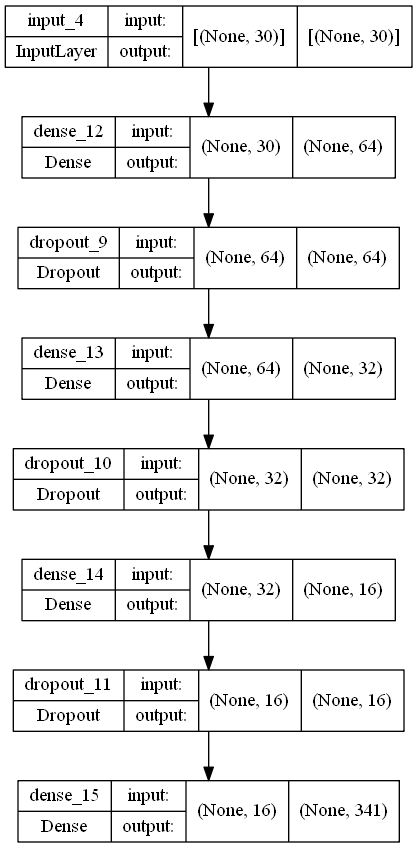
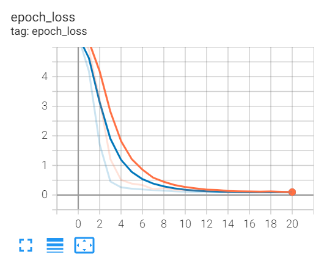
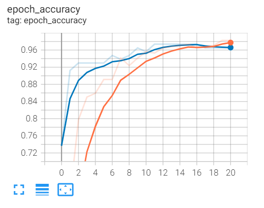
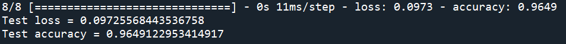
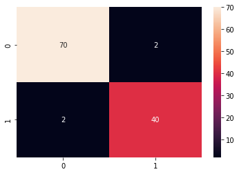

# Project-Breast Cancer Wisconsin Prediction Using Feedforward Neural Network

## 1. Summary
The aim of this project is to create a highly accurate deep learning model to predict breast cancer (whether the tumour is malignant or benign). The model is trained with [Wisconsin Breast Cancer Dataset](https://www.kaggle.com/datasets/uciml/breast-cancer-wisconsin-data)

## 2. IDE and Framework
This project is created using Sypder as the main IDE. The main frameworks used in this project are Pandas, Scikit-learn and TensorFlow Keras.

## 3. Methodology
### 3.1. Data Pipeline
The data is first loaded and preprocessed, such that unwanted features are removed (_Column 'ID' was removed as unusable_). 
Label encoded by numeric to as _**'B' (Benign) =0 & 'M' (Malignant) =1**_.  
The data is split into train-validation-test sets, with a ratio of 60:20:20.

### 3.2. Model Pipeline
A feedforward neural network is constructed that is catered for classification problem. The structure of the model is fairly simple. Figure below shows the structure of the model.

The model is trained with a batch size of 16 and for 100 epochs.  
Early stopping is applied in this training.  
The training stops at epoch 20, with a training accuracy of 98% and validation accuracy of 96%. The two figures below show the graph of the training process.

 

## 4. Results
Upon evaluating the model with test data, the model obtain the following test results, as shown in figure below.

## 5. Confusion Matrix with model prediction 
With model prediction on our test data, can see that our model is working very efficiently and accurately classifying whether the breast cancer is of Malignant type or Benign type.

